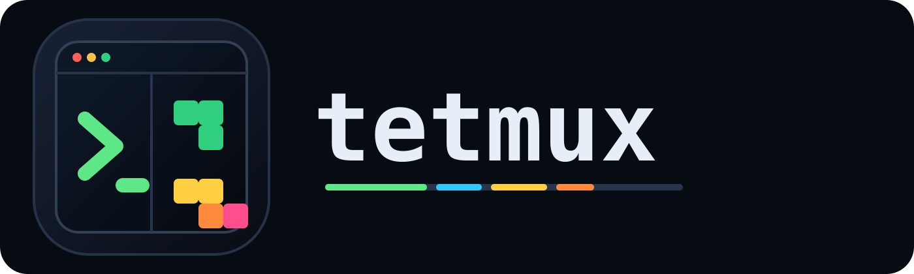

<p align="center">
  
</p>

<p align="center">
  <strong>Run a command beside Tetris while you wait.</strong>
</p>

<p align="center">
  <a href="https://github.com/lolu1032/tetmux/releases/latest"></a>
  <a href="https://github.com/lolu1032/tetmux/releases"></a>
  
  <a href="LICENSE"></a>
</p>

<p align="center">
  <a href="https://github.com/lolu1032/tetmux/releases/latest"><b>⬇&nbsp; Download for macOS · Windows · Linux</b></a>
</p>

You start an AI agent (or a long build, or a test run) and then you wait.
30 seconds here, two minutes there. tetmux splits the window: the **left** runs
your commands through real PTYs — one or more tmux-style windows that all run in
parallel (Claude in one, Codex in another, a build in a third) — and the
**right** is a Tetris game. You fill the dead time without leaving the screen, so
the moment a command needs you, you are already there.

It is the difference between a context-*destroying* distraction (picking up your
phone) and a context-*preserving* one (a game in the corner of the same window).

```
┌ tetmux    + ┬───────────────────────────┬──────────────────────────┐
│ ● 1: zsh    │ $ claude                  │   ░░░░██░░░░   HOLD  [ ]  │
│   ~ · main  │ > building the parser...  │   ░░██████░░   NEXT  [J]  │
│ ◉ 2: claude │ ✶ thinking                │   ░░░░░░░░░░         [T]  │
│   app · fix │                           │   ██░░██░░██   SCORE 1200 │
│ ○ 3: build  │ (middle: your real shell) │   (right: Tetris)  LV 3   │
└─────────────┴───────────────────────────┴──────────────────────────┘
 win 2:claude (3) ● 2 waiting | focus:TERMINAL | score 1200 · best 3400 · lv 3 | playing
```

The left **sidebar** lists your windows with a status dot — `●` unread output,
`◉` bell, `○` exited — plus each window's directory and git branch. A background
window that needs you lights up (and the status bar counts how many are
`waiting`), so you know when to look up from Tetris.

## Download

Grab the latest installer from the **[Releases page](https://github.com/lolu1032/tetmux/releases/latest)**:

| Platform | File |
|----------|------|
| **macOS** (Apple Silicon / Intel) | `tetmux-<version>-arm64.dmg` · `.dmg` |
| **Windows** | `tetmux Setup <version>.exe` |
| **Linux** | `tetmux-<version>.AppImage` · `.deb` |

> **Opening on macOS:** the app isn't notarized yet, so the first launch is
> blocked by Gatekeeper. **Right-click the app → Open** (or run
> `xattr -dr com.apple.quarantine /Applications/tetmux.app`) once, and it opens
> normally after that. Windows SmartScreen: **More info → Run anyway**.

## What you get

- **Real terminals, in parallel.** Each window is a true PTY (via `node-pty`)
  rendered with [xterm.js](https://xtermjs.org) — `vim`, `top`, an agent TUI, all
  render correctly. Run several at once; only the active one is shown, the rest
  keep working in the background.
- **Attention without babysitting.** Background windows light a sidebar dot on
  new output (`●`), bell (`◉`), or exit (`○`), and the status bar counts how many
  are waiting — so you can play and still know the instant a command needs you.
- **A real Tetris.** 7-bag randomizer, wall kicks, ghost piece, hold, 5-piece
  next preview, DAS/ARR auto-shift, lock delay, level-based speed-up, and a best
  score that persists. It **auto-pauses when you leave the pane** and resumes
  when you come back — the board waits for you while you work.
- **Per-project windows.** A new window opens in the active window's directory
  (not `$HOME`), and the sidebar shows each window's folder + git branch.

## Controls

**Focus** — click a pane to focus it; the status bar shows `focus:TERMINAL` or
`focus:TETRIS`. While playing, `Tab` or `Esc` returns focus to the terminal.
Leaving the Tetris pane **auto-pauses** a running game (it resumes when you focus
it again). A pause you set yourself with `p` stays paused until you resume it.
**Double-click a window's title** in the sidebar to rename it.

**Windows** — tmux-style prefix `Ctrl+B`, then:

| key | action | | key | action |
|-----|--------|-|-----|--------|
| `c` | new window (in the current dir) | | `n` / `p` | next / prev window |
| `1`–`9` | select window | | `&` / `x` | close window |
| `Space` | focus Tetris (play) | | `Tab` | toggle focus |
| `Ctrl+B` | send a literal `Ctrl+B` to the terminal | | | |

`Ctrl+Tab` / `Ctrl+Shift+Tab` cycle windows directly (no prefix). On macOS,
`⌘T` new · `⌘W` close · `⌘1`–`9` select · `⌘[` / `⌘]` prev/next also work.

**Tetris** (when focused) — `←`/`→` move (hold to auto-shift) · `↓` soft drop ·
`↑`/`x` rotate CW · `z` rotate CCW · `Space` hard drop · `c` hold · `p` pause ·
`r` restart · `Enter` start / retry. (Game keys resolve by physical key, so they
work the same under a non-Latin keyboard layout / IME.) Mouse: a **Restart**
button sits under the stats, and clicking the ready / game-over overlay starts a
new game.

## How it works

| Layer | Tech | Responsibility |
|-------|------|----------------|
| Main process | Electron + `node-pty` | spawns/owns real PTYs, window lifecycle, IPC, app menu |
| Preload | `contextBridge` | safe `window.tetmux` API (no `nodeIntegration`) |
| Renderer | TypeScript + Vite | xterm.js terminals, canvas Tetris, layout, keybindings |

The renderer never touches Node directly — `contextIsolation` is on and the only
bridge is a typed `window.tetmux` surface. The Tetris engine is pure and
unit-tested; the render loop idles when the game isn't playing so an open-but-idle
window costs almost nothing.

## Build from source

Requires Node 20+ and a C/C++ toolchain for `node-pty` (Xcode CLT on macOS).

```sh
cd desktop
pnpm install        # installs deps + rebuilds node-pty for Electron
pnpm dev            # launch the app with hot reload
pnpm test           # vitest
pnpm typecheck      # tsc for main/preload + renderer
pnpm package        # build a downloadable installer for the current platform
```

`pnpm package:mac` / `package:win` / `package:linux` build the per-platform
installers into `desktop/dist/`. See [`desktop/README.md`](desktop/README.md) for
the full developer guide.

## License

**[PolyForm Noncommercial 1.0.0](LICENSE)** — free for personal, hobby, academic,
and other **noncommercial** use. **Commercial use requires a separate license.**

Want to use tetmux commercially? Contact **park0001736@gmail.com** for a
commercial license.

(Bundled third-party code keeps its own license — see `third_party/`.)
